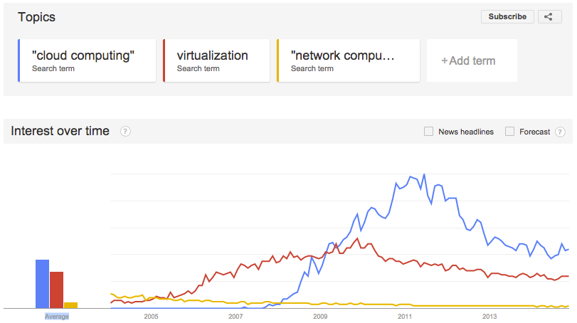

#Lunch Bytes
##Cloud Computing
The convergence of a number of computing technologies, which together enable the efficient sharing of computing resources without significant emphasis on physical location.

###Building Blocks

***Open-source movement*** -- not just "free as in beer".

 The huge collaboration of open-source software developers as provided a great deal of the fundamental infrastructure on which cloud computing rests. It is fair to say that without the open-source community, Cloud Computing would not exist.
- *Linux* -- what flavour would be like Mr Torvalds?

***Network Computer*** -- Oracle, aka Larry Ellison (mid 90s)

As early as the mid 90s, big IT companies were already making their bets on whether local computers, with local storage was obsolete. Unfortunately, for-profit companies wanted to lead the way so as to own the underlying system.

Fortunately, nobody likes Larry.

***Virtualization*** -- the Truman Show *in silico*.

Virtualization goes back to before the Internet (Yes, cool ideas were possible even then!). Though it can be bewildering when first encountered, it is nothing more than providing a virtual rather than actual resource. Most often, resources are hardware; from a single device to an entire virtual computer.

###Lexicon

***Image***

Like a photograph, an image is the captured the state of runnable computer system. Ideally, this is a completely installed and configured system.

***Container***

Effective virtualization places a running machine in a bubble. These bubbles are called containers and prevent the machines stepping on each-others toes.

***Instance***

Unlike a photograph, an image can be re-read and started. Each in their own bubble, this can be done concurrently, as many times as your resource limits permit. Each running example is an instance.

***Transient Storage***

Transient storage is there and reliable for the lifetime of an instance. Once an instance is terminated -- for whatever reason -- the storage is returned to the pool and any resident data is lost.

***Persistent Storage***

Like the local disk in a laptop or desktop, persistent storage remains until deleted by the user. Persistent storage is expensive in cloud computing and therefore not the default. It exists independent of the lifetime of any instance.

***Dynamic Allocation***

Bringing it all together, dynamic allocation is the on-demand provision of resources to support a requested instance. This includes requested memory, CPUs and transient storage. For NeCTAR this can be driven through the web-based dashboard.

###NeCTAR Cloud

- [Dashboard](https://dashboard.rc.nectar.org.au/)
- [Documentation site](https://support.rc.nectar.org.au/docs/)

***Image Flavours***

Images come in many flavours, these can be generic or tailored to particular types of work. NeCTAR has a number of _"official"_ images, each of which are base installations of recent versions of well known Linux distributions. In addition to these are _"public"_ images, which can be anything for yet more base installations to highly tailored environments for particular computational tasks. Any user can create their own images on NeCTAR.

- [NeCTAR Images](https://dashboard.rc.nectar.org.au/project/images/)

For Bioinformatics, our recommendations are the Genomics Virtual Laboratory (GVL) or in second place Bio-Linux. As with any effort within open-source, whose on top can change as developer support waxes and wanes. It is always a good idea for end-users not to become too complacent with an arbitrary choice made many years ago.

- [GVL](https://genome.edu.au/wiki/GVL) -- currently ~ release 3.4
- [Bio-Linux](http://environmentalomics.org/bio-linux/) -- currently release 8

GVL is presently a highly supported part of the NeCTAR's cloud, with the goal of making bioinformatics analysis accessible and reproducible for all biologists.

***Initial Start-up***

Images when first launched are automatically assigned a public IP address and transient storage. Transient storage exists only as long as the instance: 10GB primary (/dev/vda) and 30GB per CPU secondary (/dev/vdb). 

The primary device can be backed up by use of snap-shots, while the secondary device is excluded. Retaining data from the secondary device is left to the user.

***Methods of retaining data***

Command-line
- rsync
- scp
- sftp
 
GUI
- [filezilla](https://wiki.filezilla-project.org/Main_Page) – Multi-OS
- [gftp](http://gftp.seul.org/) – Linux
- [cyberduck](https://cyberduck.io/?l=en) – OSX

***Volumes***

These are persistent storage units, existing independent of any instance, and therefore are useful for sharing working state between instances and periods of user activity. An instance **must reside in the same zone** as a volume to which it wishes to attach.

***Zones***

- monash – Monash University
- qld – University of Queensland
- tasmania – University of Tasmania
- melbourne – Melbourne University
- NCI – Australian National University
- QRIScloud – Joint Queensland node
- sa – Joint South Australian node

Zones are physical locations which have provided computing infrastructure to the NeCTAR cloud. These range from individual institutions to consortiums.

Though UTS has access, it is not a major stake holder (doesn't provide a zone) and does not therefore have a preferential zone choice (someone correct me?) Depending on intended use, zone choice is therefore not necessarily important.
